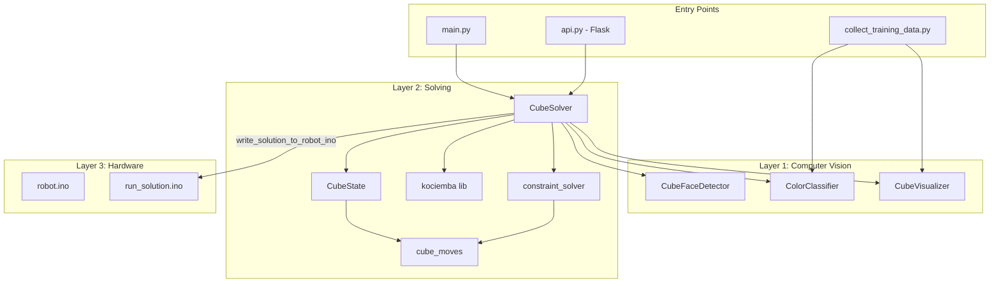
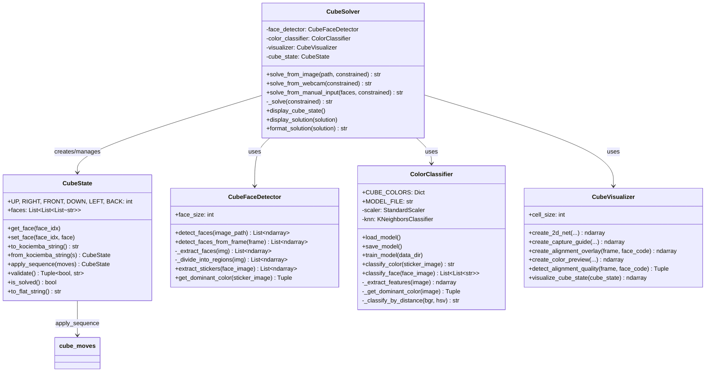
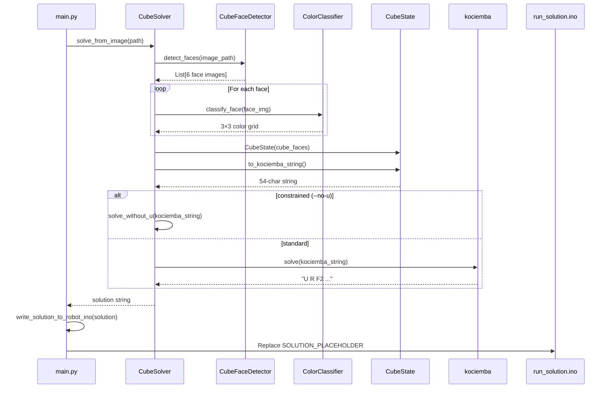
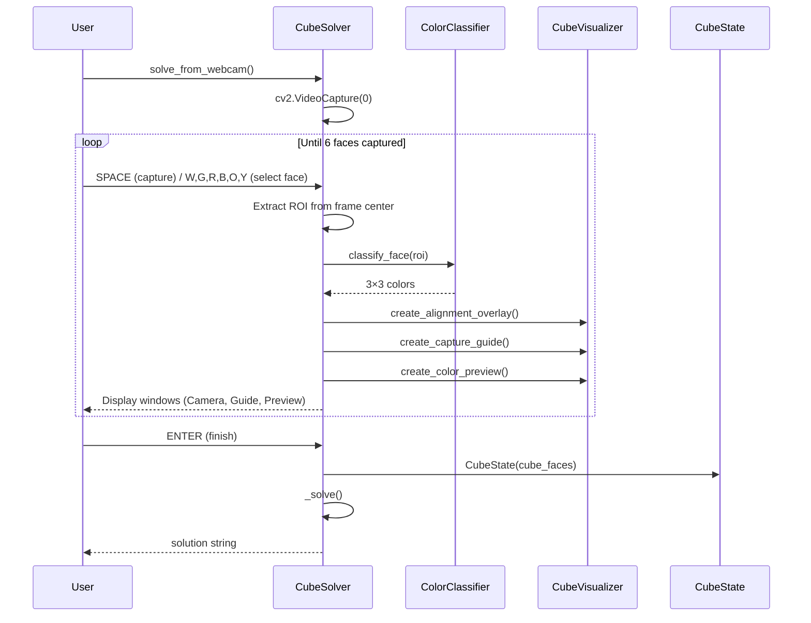
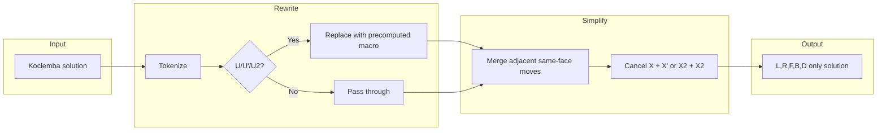
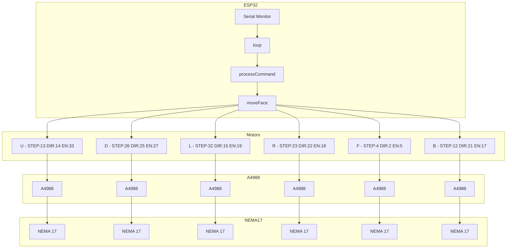
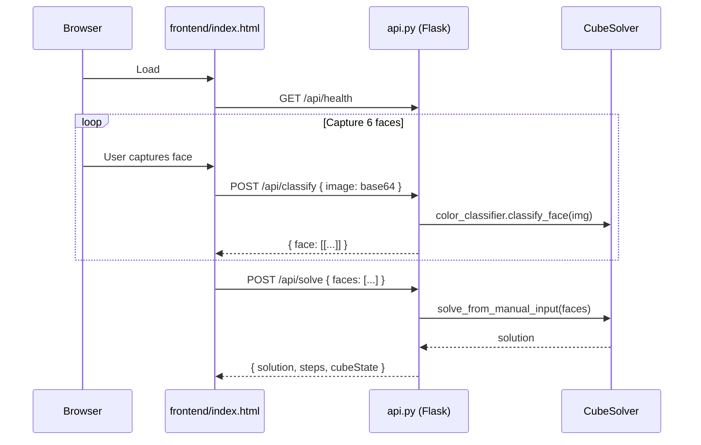
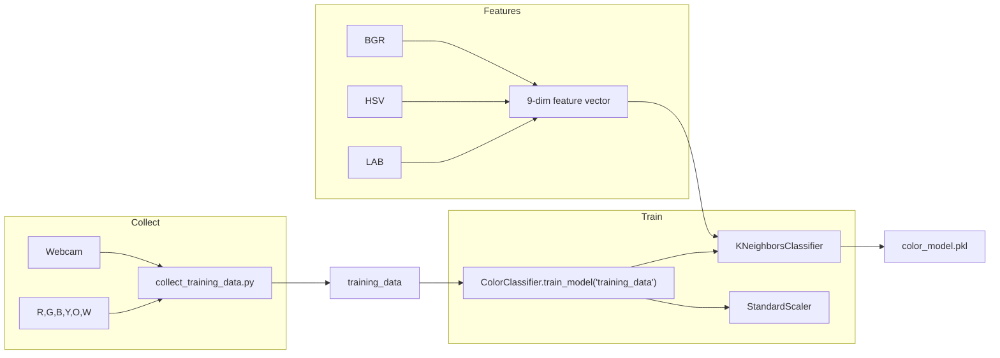
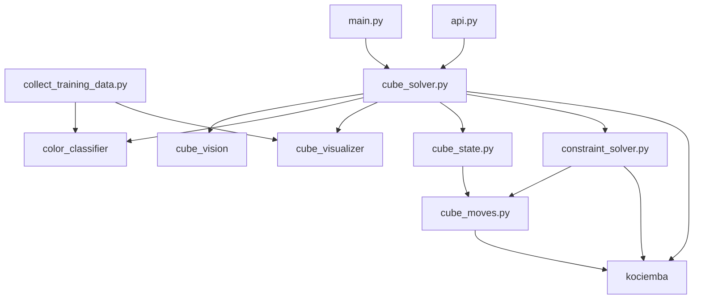

# Rubik's Cube Solver — Technical Architecture

This document describes the technical architecture of the Rubik's Cube solving robot, including data flow, component interactions, and UML diagrams.

---

## 1. System Overview

The system is organized in **three layers**:

```
┌─────────────────────────────────────────────────────────────────────────────┐
│  LAYER 1: COMPUTER VISION                                                     │
│  cube_vision.py │ color_classifier.py │ cube_visualizer.py                   │
│  Face detection │ Color classification (KNN/ML) │ 2D net guides & overlays  │
└─────────────────────────────────────────────────────────────────────────────┘
                                        │
                                        ▼
┌─────────────────────────────────────────────────────────────────────────────┐
│  LAYER 2: SOLVING ALGORITHM                                                  │
│  cube_state.py │ cube_moves.py │ cube_solver.py │ constraint_solver.py        │
│  State repr.   │ Move permutations │ kociemba integration │ 5-face variant   │
└─────────────────────────────────────────────────────────────────────────────┘
                                        │
                                        ▼
┌─────────────────────────────────────────────────────────────────────────────┐
│  LAYER 3: HARDWARE EXECUTION                                                 │
│  robot.ino │ run_solution.ino                                                │
│  ESP32 + 6× NEMA 17 steppers (A4988) │ Solution embedded or Serial trigger   │
└─────────────────────────────────────────────────────────────────────────────┘
```

**Data flow:** `CV → Solver → Solution string → Hardware`

---

## 2. High-Level Component Diagram



---

## 3. Class Diagram (Core Python Modules)



---

## 4. Data Flow: Solve from Image



---

## 5. Data Flow: Solve from Webcam



---

## 6. Cube State Representation

### Face Order (Internal & Kociemba)

| Index | Face | Color | Kociemba |
|-------|------|-------|----------|
| 0 | Up | White (W) | U |
| 1 | Right | Blue (B) | R |
| 2 | Front | Red (R) | F |
| 3 | Down | Yellow (Y) | D |
| 4 | Left | Green (G) | L |
| 5 | Back | Orange (O) | B |

### Kociemba String Format (54 chars)

```
UUUUUUUUU RRRRRRRRR FFFFFFFFF DDDDDDDDD LLLLLLLLL BBBBBBBBB
  0-8        9-17      18-26      27-35      36-44      45-53
```

### Move Notation

| Notation | Meaning |
|----------|---------|
| `U` | Up face, 90° clockwise |
| `U'` | Up face, 90° counter-clockwise |
| `U2` | Up face, 180° |
| Same for R, F, D, L, B | |

---

## 7. Constraint Solver (5-Face / No-U Mode)

When the robot has no motor on the Up face, the constraint solver rewrites U moves into equivalent L,R,F,B,D sequences.



**Macro discovery:** BFS from solved state using only L,R,F,B,D moves. Target states: `U`, `U'`, `U2` applied to solved cube. Precomputed macros can be loaded from `precomputed_u_macros_5faces.json`.

---

## 8. Move Permutations (cube_moves.py)

Facelet indices follow kociemba: U(0-8), R(9-17), F(18-26), D(27-35), L(36-44), B(45-53).

```mermaid
flowchart TB
    subgraph Permutation Logic
        P[54-element permutation array]
        A[Apply: new[i] = old[perm[i]]]
    end

    subgraph Move Table
        U["U, U', U2"]
        D["D, D', D2"]
        R["R, R', R2"]
        L["L, L', L2"]
        F["F, F', F2"]
        B["B, B', B2"]
    end

    subgraph Functions
        apply["apply_sequence(cubestring, moves)"]
        kociemba_apply["apply_sequence_kociemba() - uses pykociemba"]
    end

    U --> P
    D --> P
    R --> P
    L --> P
    F --> P
    B --> P
    P --> A
    A --> apply
```

`apply_sequence_kociemba` uses the kociemba library's `FaceCube`/`CubieCube` for exact convention matching with the solver output.

---

## 9. Hardware Architecture (ESP32)



### robot.ino vs run_solution.ino

| Sketch | Purpose | Trigger |
|--------|---------|---------|
| `robot.ino` | Test: paste algorithm in Serial Monitor | Enter |
| `run_solution.ino` | Production: solution embedded by Python | SPACE + Enter |

### Speed Profiles

- **Side faces (L,R,F,B):** `SIDE_START_DELAY = 800`, `SIDE_TARGET_DELAY = 100`, `SIDE_RAMP = 200`
- **U/D faces:** `UD_START_DELAY = 800`, `UD_TARGET_DELAY = 200`, `UD_RAMP = 250`
- **Physical direction:** F and L motors have reversed wiring; `physicalClockwise` is inverted in `run_solution.ino`

---

## 10. API / Web Frontend



---

## 11. Training Pipeline (Color Classifier)



---

## 12. File Dependency Graph



---

## 13. Key Dependencies

| Package | Purpose |
|---------|---------|
| `opencv-python` | Image I/O, face detection, visualization |
| `numpy` | Array operations |
| `scikit-learn` | KMeans, KNN, StandardScaler |
| `kociemba` | Optimal cube solver (two-phase algorithm) |
| `flask` / `flask-cors` | REST API for web frontend |

---

## 14. Glossary

| Term | Definition |
|------|------------|
| **Face** | One of 6 cube sides (U, R, F, D, L, B) |
| **Facelet** | Single sticker; 9 per face, 54 total |
| **Kociemba string** | 54-char representation in URFDLB order |
| **Macro** | Sequence of moves equivalent to a single U/U'/U2 |
| **ROI** | Region of interest (center crop for webcam capture) |
| **2D net** | Unfolded cube layout for capture guidance |
